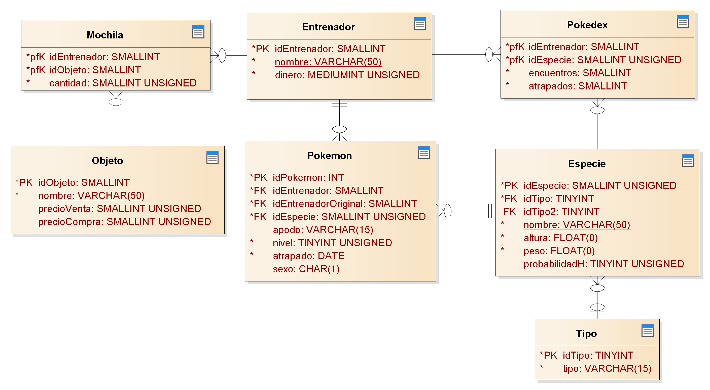

<h1 align="center">E.T. Nº12 D.E. 1º "Libertador Gral. José de San Martín"</h1>
<p align="center">
  
</p>

Material de consumo para las consultas de Base de Datos.

## DER



## Comenzando 🚀

Clonar el repositorio github, desde Github Desktop o ejecutar en la terminal o CMD:

```
git clone https://github.com/ET12DE1Computacion/BD-PokemonRPG
```

## Pre-requisitos 📋

- MySQL 8 🐬

## Despliegue 📦

1. Abrir la terminal en el directorio donde están los scripts (recomendamos tener MySQL agregado en tus **Variables de entorno**).

1. Ejecutar el comando: `mysql -u usuario -p` donde *usuario* es el nombre de usuario con el que entras al sistema. Si estas en la secu podes usar: `mysql -u root -p`. Se te va a preguntar por la contraseña de tu usuario, recorda que si estas en la secu la misma es *root*.

1. Ya dentro del cliente de `MySQL` tipeamos `source install.sql` y nos debería quedar algo como: `mysql> source install.sql` ; le damos _Enter_.

1. Esperamos que termine de correr el comando y salimos de la _shell_ de MySQL con el comando `exit`.

## Guia de ejercicios

[Ejercicios de Bases de Datos 4º](ejercicios/04%20BD/README.md)

## Colaboradores

| Año   | División| Participante                                                                | Commit                                                                                                          |
| :---: | :---:   |       :---                                                                  | :---                                                                                                            |
| 2021  | 5° 8°   | Lucas Medina ([@LucasMedina04](https://github.com/LucasMedina04))                    | [f41c468](https://github.com/ET12DE1Computacion/BD-PokemonRPG/commit/f41c4689b1147b4af05cdc8a1c1ae35171fb7f2d)    |
| 2021  | 5° 8°   | Lucas Medina ([@LucasMedina04](https://github.com/LucasMedina04))                    | [b849708](https://github.com/ET12DE1Computacion/BD-PokemonRPG/commit/b8497080352a823a57a03beddeafa8c0c640a879)    |
| 2021  | 5° 8°   | Ezequiel Kippes ([@Liono02](https://github.com/Liono02))                             | [006d076](https://github.com/ET12DE1Computacion/BD-PokemonRPG/commit/006d076b88312ade579afeec89d4bc51ade5b803)    |
| 2021  | 5° 8°   | Lucas Medina ([@LucasMedina04](https://github.com/LucasMedina04))                    | [a4cefc7](https://github.com/ET12DE1Computacion/BD-PokemonRPG/commit/a4cefc7adaf001151e2a83d7e8ea948464321706)    |
| 2021  | 4° 7°   | Breider Loreto ([@Breider-Loreto](https://github.com/Breider-Loreto))                | [31adbf5](https://github.com/ET12DE1Computacion/BD-PokemonRPG/commit/31adbf590e26b5406897a7c380a96da1c7c8560f)    |
| 2021  | 4° 7°   | Abril Chauque ([@abrilchauq](https://github.com/abrilchauq))                         | [42de5a7](https://github.com/ET12DE1Computacion/BD-PokemonRPG/commit/42de5a75820f831fa72a6cf2b260fcaff3175a3a)    |
| 2021  | 4° 7°   | Maximo Yampa ([@MaximoYampa](https://github.com/MaximoYampa))                        | [8d754c9](https://github.com/ET12DE1Computacion/BD-PokemonRPG/commit/8d754c91f554bb7fadf21b4fcb20986a84f2f4b9)    |
| 2021  | 4° 7°   | José Cruz ([@josesinio](https://github.com/josesinio))                               | [0a2f716](https://github.com/ET12DE1Computacion/BD-PokemonRPG/commit/0a2f7164996de01f6809a29ea9e715dab49bf513)    |
| 2021  | 4° 7°   | Lucia Barcenas ([@Lucia-Barcenas](https://github.com/Lucia-Barcenas))                | [d09c1d6](https://github.com/ET12DE1Computacion/BD-PokemonRPG/commit/d09c1d6d9bdb25c60167547f5c86bcef723b604d)    |
| 2022  | 5° 8°   | Facundo Recalde ([@recalDER](https://github.com/recalDER))                           | [546e7c6](https://github.com/ET12DE1Computacion/BD-PokemonRPG/commit/546e7c63ae1051a28ec20bc43e96fb7b72bdec20)    |
| 2022  | 5° 8°   | Magali Rodriguez ([@magalirodriguez09](https://github.com/magalirodriguez09))        | [f9cce50](https://github.com/ET12DE1Computacion/BD-PokemonRPG/commit/f9cce5039c970a8a2440d864544fbbdceb6133a3)    |
