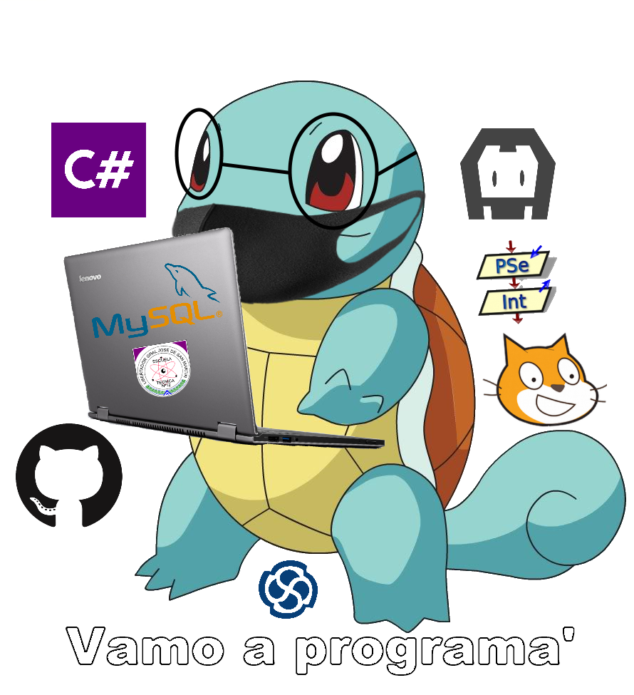

<h1 align="center">E.T. Nº12 D.E. 1º "Libertador Gral. José de San Martín"</h1>

  

<h1 align="center">PokemonRPG</h1>

  

Material de consumo para las consultas de Base de Datos.

## DER

## Colaboradores

| Año   | División| Participante                                                                | Commit                                                                                                          |
| :---: | :---:   |       :---                                                                  | :---                                                                                                            |
| 2021  | 5° 8°   | Lucas Medina ([@LucasMedina04](https://github.com/LucasMedina04))                    | [f41c468](https://github.com/ET12DE1Computacion/CellWorldDB/commit/f41c4689b1147b4af05cdc8a1c1ae35171fb7f2d)    |
